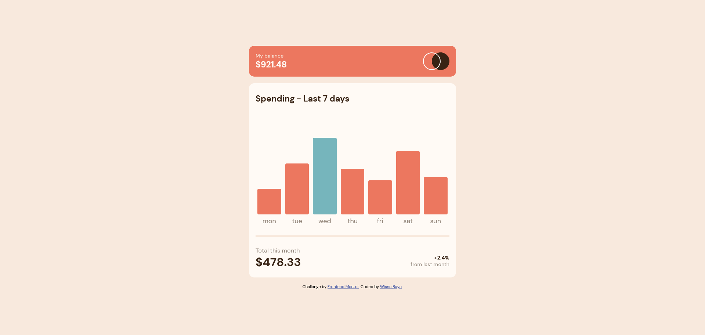

# Frontend Mentor - Expenses chart component solution

This is a solution to the [Expenses chart component challenge on Frontend Mentor](https://www.frontendmentor.io/challenges/expenses-chart-component-e7yJBUdjwt). Frontend Mentor challenges help you improve your coding skills by building realistic projects. 

## Table of contents

- [Overview](#overview)
  - [The challenge](#the-challenge)
  - [Screenshot](#screenshot)
  - [Links](#links)
- [My process](#my-process)
  - [Built with](#built-with)
  - [Useful resources](#useful-resources)
- [Author](#author)

## Overview

### The challenge

Users should be able to:

- View the bar chart and hover over the individual bars to see the correct amounts for each day
- See the current day’s bar highlighted in a different colour to the other bars
- View the optimal layout for the content depending on their device’s screen size
- See hover states for all interactive elements on the page
- **Bonus**: Use the JSON data file provided to dynamically size the bars on the chart

### Screenshot

### Links

- Solution URL: [Solution URL](https://www.frontendmentor.io/solutions/expenses-chart-json-interactive-cOT1gIWhUY)
- Live Site URL: [Site URL](https://wishba.github.io/expenses-chart-component-main/)

## My process

### Built with

- Semantic HTML5 markup
- CSS custom properties
- Mobile-first workflow

### Useful resources

- [How to Fetch and Display JSON](https://howtocreateapps.com/fetch-and-display-json-html-javascript/#:~:text=Fetching%20the%20JSON%20data.%20To%20be%20able%20to,%7B%20%20%2F%2F%20If%20an%20error%20occured%2C%20) - How to appendChild with for loop.
- [JavaScript Template Literals: JSON to HTML
](https://www.youtube.com/watch?v=DG4obitDvUA) - Help me formatting innerHTML.

## Author

- Frontend Mentor - [@wishba](https://www.frontendmentor.io/profile/wishba)
- Twitter - [@wishba_](https://twitter.com/wishba_)